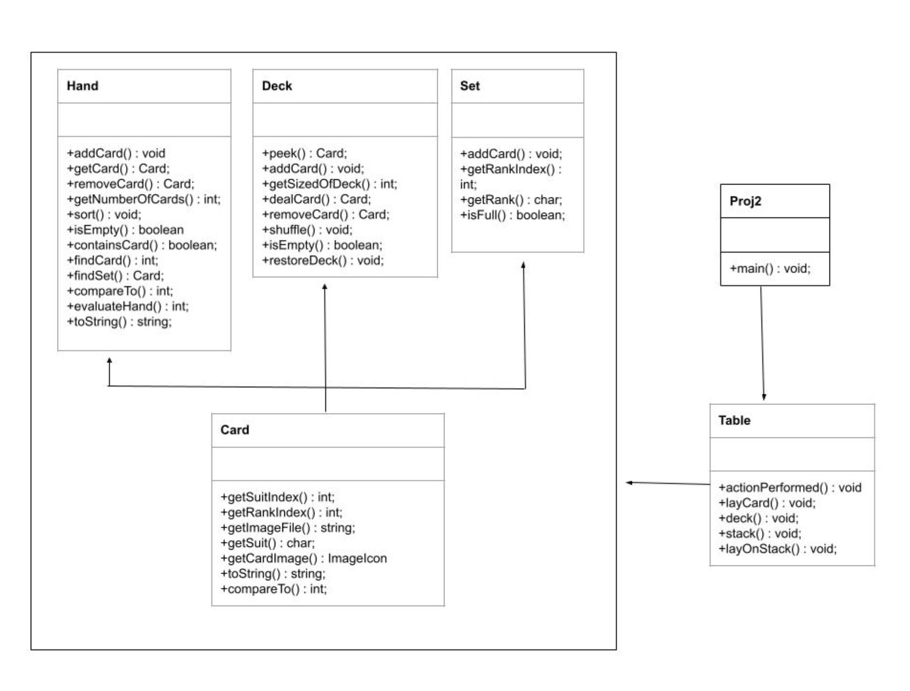
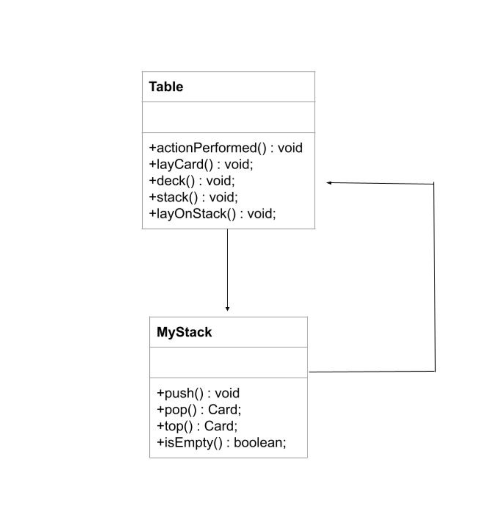

# JDK Version that I used on my computer is 15.0.2

# Help recived:

I had no help from classmates in order to make this project
The help that i got from the internet are these:

1. How to make a hashset in order to help me find the lay of the same set:
https://www.javatpoint.com/java-hashset#:~:text=Java%20HashSet%20class%20is%20used,using%20a%20mechanism%20called%20hashing.

2. Also a little refresh on stack and their structures:
https://www.javatpoint.com/java-stack#:~:text=In%20Java%2C%20Stack%20is%20a,we%20must%20import%20the%20java.

# Extra credit:

1. I added so that when the game starts there is a card at the stack.

2. Added button to either play with a generated player or you can just press on the player 2 button 
(that is not the autoplay button) in order to play with other person. BEWARE: In the next section it
is explain how it is implemented in order to work.

# Changes and functionalities on how to play the game:

1. In the game player 1 is always a real person not generated 

2. The game starts by player 1 or 2 selecting a card either from deck or stack. 
Then the player can set ranks or discard a card. The logic of the game makes it possible
so that each player has its turns. Also, if a player makes a move when that player is not
supposed to go, in the output (terminal) there will be message. 

3. The changes in the GUI makes it possible so that when a player has at least added and discarted a card,
to select the button "Player Turn is over" so that the other player can go. 

4. The implementation allows to create a txt file with the moves of each player and who wins. 

5. Also in the GUI there will be a button in Player 2 to be able to make random choices, it
is called "Auto Play". You have to press "Players 1 turn is over" button in order to then press 
"Auto play" and to play with the computer. This needs to be done each time, meaning when you press
that your turn is over, also press auto play. 
    
Also once autoplay is pressed you are sucked with a generated
player. If you press in player 2 section either stack, lay, deck, or layonstack, it is not going to let you
make the moves because it is on auto play. If you want to change to play with a real person you have to close the 
game and run it again, then the player two normaly presses the options that are not autoplay.

The same thing needs to be done when you started playing with a real person. In order to change to autoplay you hace to
close the game and run it again, then press autoplay. 

6. The MyStack was implemented with its actions and PileInterface

7. In the terminal it will be displayed each move the players make, the turns and if it is not your turn. 

# Design patterns in the existing code:

The relationships between the classes are that the Table class makes the Deck, Hand, Set and Stack objects. 
This class calls and manipulated each class of Deck, Hand, Set and Stack based on the action performed in the GUI. 
The classes of Deck, Hand and Set use the Card class as an object model in order to add, change cards of the set, deck and hand. 
It could be said that the design pattern that is present is MVC Pattern because Table calls the controller (which is Hand, Deck and Set) 
and this controller uses the model class Card) in order to be able to add, remove cards from the Hand, Deck and Set. The view part of 
the MVC Pattern is hard to notice but I believe it is in table when the action performed of lay calls (lay(card)). This makes the 
terminal output the card that was put on the set.

# Design Patterns implemented:
    
    
# Factory Pattern:
    

# Simpleton Pattern:

    
    
    
